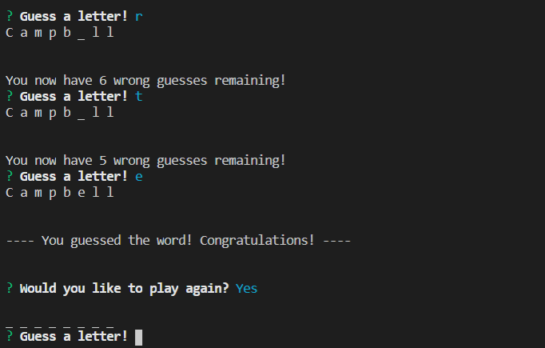
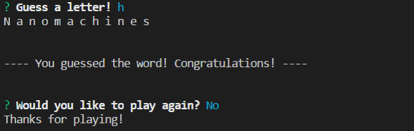

# Word Guess CLI

This word guess command-line game allows the user to guess a word with 10 incorrect guesses per word.

## Game examples ~

1. Game Flow -

This is what a game might look like when a user is trying to guess a word.

2. Wrong Input  -

Incase the user types in an invalid character, or too many letters at once, the user is informed to have a valid input.

In the event a letter has already been guessed the user isn't penalized and is provided with a message.

3. Finished Word -

After finishing the word the user can opt to play again with a new word.

